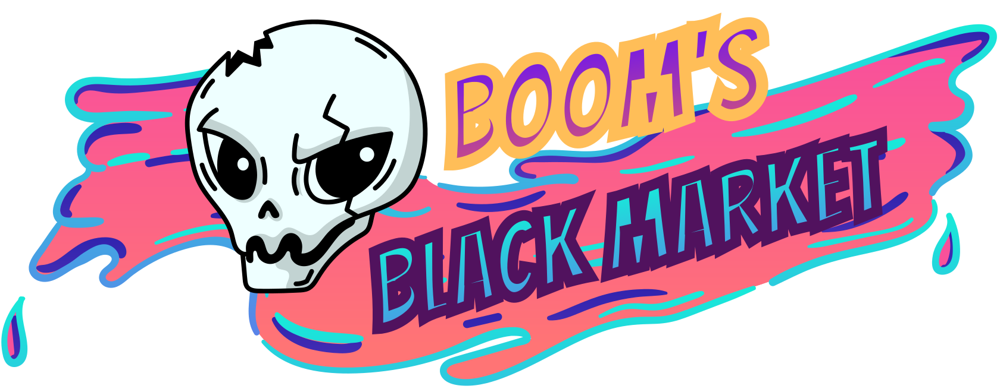
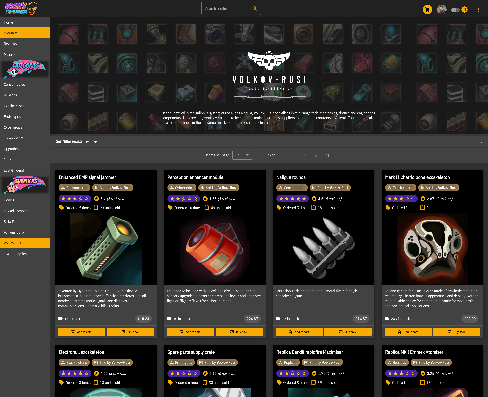

# Sci-fi-themed Angular project

This is a sci-fi themed Angular application, brimming with advanced features (including its own fictitious lore) and focused on user experience.

 

## [Visit the app](https://xpulse.vercel.app)
Here is a preview of the products page.

## Key product features
- Built with **Angular Material** components.
- Reactive state management with NGRX Store.
- Side-effect-driven architecture implemented via NGRX Effects in response to network requests.
- Service-based design to isolate core tasks (fetching data and updating state) away from components.
- Extensive CRUD functionality allowing users to interact with products, cart, wishlist, reviews and user account.
- Multiple themes implemented with Sass variables and mixins, using Angular Material's theming system.
- Mock payments processing via Stripe API, allowing for multiple payment options.
- Authentication via local strategies as well as single sign-on with Facebook, Amazon and Google.

## Webpages
The app contains various pages. Here are the main ones:
- Products (with pagination and filtering)
- Single product
- Orders
- Single order
- Cart
- Wishlist
- Favorites
- Reviews (with pagination and filtering)
- Login/signup
- Checkout

